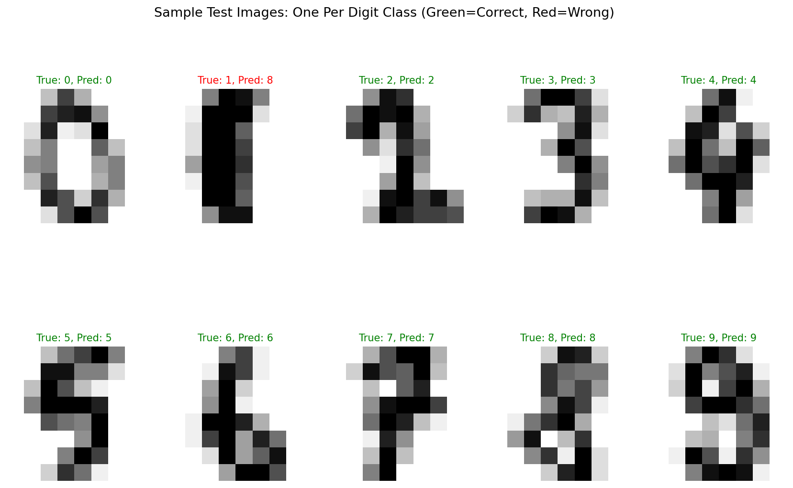

# Handwritten Digit Classification — CS6140 Machine Learning (HW2, Q7)

Multi-class classification and multi-label property prediction on 8×8 handwritten digit images using logistic regression.

## Overview

This project implements three tasks on the [UCI Handwritten Digits](https://archive.ics.uci.edu/dataset/80/optical+recognition+of+handwritten+digits) dataset (64-dimensional feature vectors from 8×8 pixel images):

- **Part 1 — Multi-Class (Softmax):** 10-way digit classification (0–9) using multinomial logistic regression. Achieves **97.78% test accuracy**.
- **Part 2 — Multi-Label (Sigmoid):** Predicts three binary properties per digit (`is_even`, `is_greater_than_5`, `is_prime`) using independent binary logistic regression models.
- **Part 3 — Hierarchical Bridge:** Uses the softmax model's 10-class probability output as features for property prediction, demonstrating that identity-based representations outperform raw pixels.

## Results

### Part 1: Multi-Class Classification

**Training accuracy:** 100.00% | **Test accuracy:** 97.78%

#### Coefficient Distribution — Class 0 vs Class 7


#### Per-Class Test Accuracy


#### Sample Test Images with Predictions


### Part 2 vs Part 3: Multi-Label Property Prediction

| Property | Raw Pixels (Test) | Class Probabilities (Test) |
|---|---|---|
| is_even | 91.33% | **98.67%** |
| is_greater_than_5 | 86.44% | **98.67%** |
| is_prime | 95.11% | **99.56%** |

Using class probability features from the softmax model (Part 3) substantially outperforms raw pixel features (Part 2) because these properties are deterministic functions of digit identity — the hierarchical approach reduces dimensionality (64 → 10) while preserving task-relevant information.

## Dataset

Place the following CSV files in the same directory as the script:

| File | Description |
|---|---|
| `X_train.csv` | Training features (1347 × 64), pixel values 0–255 |
| `X_test.csv` | Test features (450 × 64) |
| `y_train.csv` | Training labels (digits 0–9) |
| `y_test.csv` | Test labels |
| `y_MLL_train.csv` | Multi-label training targets: [is_even, is_greater_than_5, is_prime] |
| `y_MLL_test.csv` | Multi-label test targets |

## Requirements

```
numpy
pandas
matplotlib
scikit-learn
```

Install with:

```bash
pip install numpy pandas matplotlib scikit-learn
```

## Usage

```bash
python hw2-BangaloreArun.py
```

The script outputs accuracy metrics to the console and saves three plots:

- `Part_1_1.png` — Coefficient distribution for class 0 vs class 7
- `Part-1_2.png` — Per-class test accuracy bar chart
- `Part_1_b_iv.png` — Sample test images with true/predicted labels

## Project Structure

```
.
├── hw2-BangaloreArun.py
├── X_train.csv
├── X_test.csv
├── y_train.csv
├── y_test.csv
├── y_MLL_train.csv
├── y_MLL_test.csv
├── Part_1_1.png
├── Part-1_2.png
├── Part_1_b_iv.png
└── README.md
```

## Author

Mandar Bangalore Arun — Northeastern University, CS6140 Machine Learning (Spring 2026)
